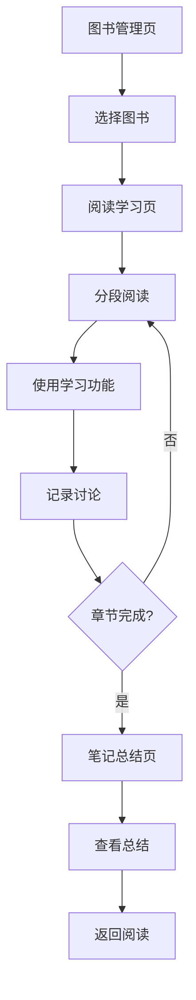

## 1. 产品概述
一个基于网页的EPUB电子书阅读和学习应用，专为家长和孩子共同阅读设计。支持分段阅读、语音朗读、翻译、单词学习、图片示意、讨论记录和智能分析功能。

解决传统电子书阅读缺乏互动性和学习辅助的问题，帮助家长和孩子更好地理解和记忆阅读内容，促进亲子共读和学习效果。

## 2. 核心功能

### 2.1 用户角色
| 角色 | 注册方式 | 核心权限 |
|------|----------|----------|
| 读者用户 | 邮箱注册 | 上传EPUB、阅读书籍、使用学习功能、记录讨论 |

### 2.2 功能模块
应用包含以下主要页面：
1. **图书管理页**：EPUB上传、图书列表、阅读进度管理。
2. **阅读学习页**：分段阅读、语音朗读、翻译、单词学习、图片生成、讨论记录。
3. **笔记总结页**：章节笔记查看、讨论整理、智能分析、复习总结。

### 2.3 页面详情
| 页面名称 | 模块名称 | 功能描述 |
|-----------|-------------|-------------|
| 图书管理页 | 图书上传 | 拖拽或选择上传EPUB文件，解析并存储图书内容。 |
| 图书管理页 | 图书列表 | 显示已上传图书封面、标题、阅读进度，支持删除和继续阅读。 |
| 阅读学习页 | 分段阅读 | 将章节内容按段落分割显示，支持前后翻页和进度跳转。 |
| 阅读学习页 | 语音朗读 | 点击段落生成并播放该段落的语音朗读，支持语速调节。 |
| 阅读学习页 | 中文翻译 | 点击段落生成该段落的完整中文翻译，支持原文对照显示。 |
| 阅读学习页 | 单词学习 | 点击单个单词显示发音、词义和例句，支持收藏生词。 |
| 阅读学习页 | 图片示意 | 为段落生成示意图片帮助理解，支持图片保存和分享。 |
| 阅读学习页 | 讨论记录 | 记录用户和孩子对段落的讨论内容，支持实时编辑和保存。 |
| 笔记总结页 | 章节笔记 | 汇总该章节所有段落的讨论记录，支持编辑和整理。 |
| 笔记总结页 | 智能分析 | 基于讨论内容生成深入分析和补充知识点，延伸学习建议。 |
| 笔记总结页 | 复习总结 | 根据章节讨论生成学习总结，包含重点词汇、关键概念等。 |

## 3. 核心流程

### 用户阅读学习流程
1. 用户上传EPUB图书到系统
2. 选择图书开始阅读，进入阅读学习页面
3. 逐段阅读内容，点击段落使用各项学习功能
4. 记录与孩子的讨论内容
5. 完成章节后查看生成的笔记和总结
6. 根据总结进行复习和巩固

## 4. 用户界面设计

### 4.1 设计风格
- **主色调**：温暖的知识蓝色 (#2563eb) 搭配柔和的白色背景
- **按钮样式**：圆角矩形设计，主要操作为实心填充，次要操作为边框样式
- **字体选择**：中文使用思源黑体，英文使用Inter字体，正文16px，标题24px
- **布局风格**：左侧导航栏 + 主内容区域的卡片式布局
- **图标风格**：使用简洁的线性图标，突出教育学习的温馨感

### 4.2 页面设计概述
| 页面名称 | 模块名称 | UI元素 |
|-----------|-------------|-------------|
| 图书管理页 | 图书上传 | 中央拖拽区域，虚线边框，上传图标，支持文件拖拽 |
| 图书管理页 | 图书列表 | 网格布局显示图书卡片，包含封面图、标题、进度条 |
| 阅读学习页 | 分段阅读 | 左侧段落列表，右侧主要内容区域，清晰的段落分隔 |
| 阅读学习页 | 学习工具栏 | 顶部固定工具栏，包含朗读、翻译、图片等按钮 |
| 阅读学习页 | 讨论面板 | 右侧可折叠讨论面板，支持实时编辑和查看历史 |
| 笔记总结页 | 笔记展示 | 时间线式展示讨论记录，支持编辑和重新组织 |
| 笔记总结页 | 智能分析 | 卡片式展示分析结果，包含知识点和延伸建议 |

### 4.3 响应式设计
采用桌面优先设计策略，确保在大屏幕上提供最佳阅读体验。同时支持平板设备自适应，在移动设备上提供基础功能支持。触摸交互优化，确保点击、滑动等操作流畅自然。