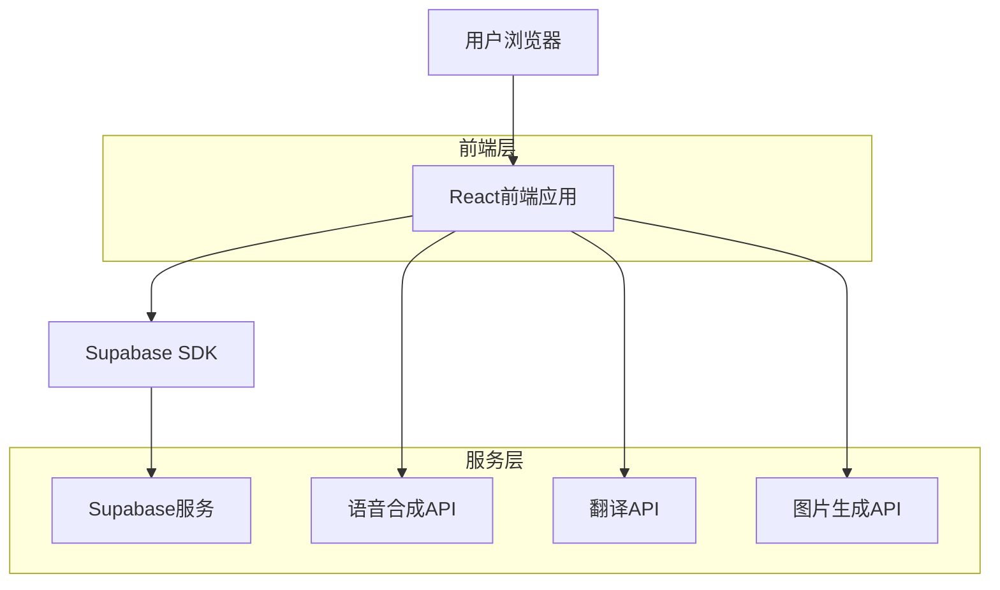
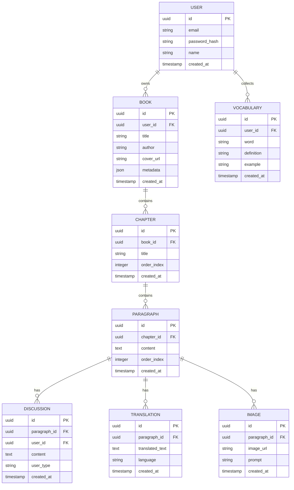

## 1. 架构设计



## 2. 技术描述

- **前端**: React@18 + TailwindCSS@3 + Vite
- **初始化工具**: vite-init
- **后端**: Supabase (提供认证、数据库、文件存储)
- **外部API**: 
  - 语音合成服务 (如Web Speech API或第三方TTS)
  - 翻译API (如Google Translate API)
  - 图片生成API (如DALL-E或Stable Diffusion)

## 3. 路由定义

| 路由 | 用途 |
|-------|---------|
| / | 图书管理页，显示用户上传的图书列表 |
| /reader/:bookId | 阅读学习页，显示图书内容和各项学习功能 |
| /notes/:chapterId | 笔记总结页，显示章节讨论记录和智能分析 |
| /login | 登录页面，用户身份验证 |
| /register | 注册页面，新用户注册 |

## 4. API定义

### 4.1 图书管理API

**上传EPUB文件**
```
POST /api/books/upload
```

请求:
| 参数名 | 参数类型 | 是否必需 | 描述 |
|-----------|-------------|-------------|-------------|
| file | File | 是 | EPUB文件 |
| title | string | 否 | 图书标题（自动提取） |

响应:
| 参数名 | 参数类型 | 描述 |
|-----------|-------------|-------------|
| bookId | string | 图书唯一标识符 |
| title | string | 图书标题 |
| cover | string | 封面图片URL |

### 4.2 学习功能API

**生成语音朗读**
```
POST /api/tts/generate
```

请求:
| 参数名 | 参数类型 | 是否必需 | 描述 |
|-----------|-------------|-------------|-------------|
| text | string | 是 | 要朗读的文本 |
| language | string | 否 | 语言代码，默认en |

响应:
| 参数名 | 参数类型 | 描述 |
|-----------|-------------|-------------|
| audioUrl | string | 语音文件URL |

**生成翻译**
```
POST /api/translate/generate
```

请求:
| 参数名 | 参数类型 | 是否必需 | 描述 |
|-----------|-------------|-------------|-------------|
| text | string | 是 | 要翻译的文本 |
| targetLang | string | 否 | 目标语言，默认zh |

响应:
| 参数名 | 参数类型 | 描述 |
|-----------|-------------|-------------|
| translation | string | 翻译结果 |

**生成示意图片**
```
POST /api/image/generate
```

请求:
| 参数名 | 参数类型 | 是否必需 | 描述 |
|-----------|-------------|-------------|-------------|
| text | string | 是 | 段落文本 |
| style | string | 否 | 图片风格，默认educational |

响应:
| 参数名 | 参数类型 | 描述 |
|-----------|-------------|-------------|
| imageUrl | string | 生成图片URL |

### 4.3 讨论记录API

**保存讨论记录**
```
POST /api/discussions/save
```

请求:
| 参数名 | 参数类型 | 是否必需 | 描述 |
|-----------|-------------|-------------|-------------|
| paragraphId | string | 是 | 段落ID |
| content | string | 是 | 讨论内容 |
| userType | string | 是 | 用户类型（parent/child） |

响应:
| 参数名 | 参数类型 | 描述 |
|-----------|-------------|-------------|
| discussionId | string | 讨论记录ID |

## 5. 数据模型

### 5.1 数据模型定义



### 5.2 数据定义语言

**用户表 (users)**
```sql
-- 创建表
CREATE TABLE users (
    id UUID PRIMARY KEY DEFAULT gen_random_uuid(),
    email VARCHAR(255) UNIQUE NOT NULL,
    password_hash VARCHAR(255) NOT NULL,
    name VARCHAR(100) NOT NULL,
    created_at TIMESTAMP WITH TIME ZONE DEFAULT NOW(),
    updated_at TIMESTAMP WITH TIME ZONE DEFAULT NOW()
);

-- 创建索引
CREATE INDEX idx_users_email ON users(email);
```

**图书表 (books)**
```sql
-- 创建表
CREATE TABLE books (
    id UUID PRIMARY KEY DEFAULT gen_random_uuid(),
    user_id UUID REFERENCES users(id) ON DELETE CASCADE,
    title VARCHAR(500) NOT NULL,
    author VARCHAR(255),
    cover_url TEXT,
    metadata JSONB DEFAULT '{}',
    created_at TIMESTAMP WITH TIME ZONE DEFAULT NOW(),
    updated_at TIMESTAMP WITH TIME ZONE DEFAULT NOW()
);

-- 创建索引
CREATE INDEX idx_books_user_id ON books(user_id);
CREATE INDEX idx_books_created_at ON books(created_at DESC);
```

**章节表 (chapters)**
```sql
-- 创建表
CREATE TABLE chapters (
    id UUID PRIMARY KEY DEFAULT gen_random_uuid(),
    book_id UUID REFERENCES books(id) ON DELETE CASCADE,
    title VARCHAR(500) NOT NULL,
    order_index INTEGER NOT NULL,
    created_at TIMESTAMP WITH TIME ZONE DEFAULT NOW()
);

-- 创建索引
CREATE INDEX idx_chapters_book_id ON chapters(book_id);
CREATE INDEX idx_chapters_order ON chapters(book_id, order_index);
```

**段落表 (paragraphs)**
```sql
-- 创建表
CREATE TABLE paragraphs (
    id UUID PRIMARY KEY DEFAULT gen_random_uuid(),
    chapter_id UUID REFERENCES chapters(id) ON DELETE CASCADE,
    content TEXT NOT NULL,
    order_index INTEGER NOT NULL,
    created_at TIMESTAMP WITH TIME ZONE DEFAULT NOW()
);

-- 创建索引
CREATE INDEX idx_paragraphs_chapter_id ON paragraphs(chapter_id);
CREATE INDEX idx_paragraphs_order ON paragraphs(chapter_id, order_index);
```

**讨论记录表 (discussions)**
```sql
-- 创建表
CREATE TABLE discussions (
    id UUID PRIMARY KEY DEFAULT gen_random_uuid(),
    paragraph_id UUID REFERENCES paragraphs(id) ON DELETE CASCADE,
    user_id UUID REFERENCES users(id) ON DELETE CASCADE,
    content TEXT NOT NULL,
    user_type VARCHAR(20) CHECK (user_type IN ('parent', 'child')),
    created_at TIMESTAMP WITH TIME ZONE DEFAULT NOW()
);

-- 创建索引
CREATE INDEX idx_discussions_paragraph_id ON discussions(paragraph_id);
CREATE INDEX idx_discussions_user_id ON discussions(user_id);
CREATE INDEX idx_discussions_created_at ON discussions(created_at DESC);
```

**权限设置**
```sql
-- 授予匿名用户基本读取权限
GRANT SELECT ON books TO anon;
GRANT SELECT ON chapters TO anon;
GRANT SELECT ON paragraphs TO anon;

-- 授予认证用户完整权限
GRANT ALL PRIVILEGES ON users TO authenticated;
GRANT ALL PRIVILEGES ON books TO authenticated;
GRANT ALL PRIVILEGES ON chapters TO authenticated;
GRANT ALL PRIVILEGES ON paragraphs TO authenticated;
GRANT ALL PRIVILEGES ON discussions TO authenticated;
GRANT ALL PRIVILEGES ON translations TO authenticated;
GRANT ALL PRIVILEGES ON images TO authenticated;
GRANT ALL PRIVILEGES ON vocabulary TO authenticated;
```